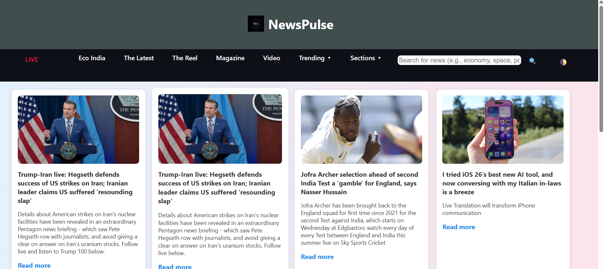

# 📰 NewsPulse - Live Headlines

**NewsPulse** is a responsive and interactive news web application that delivers live and trending headlines in real-time. Built using HTML, CSS, and JavaScript, it integrates the [GNews API](https://gnews.io/) to provide users with up-to-date articles from various categories, including politics, technology, science, and more.

---

## 📸 Preview



---

## 🌐 Live Demo

🔗 **Hosted on GitHub Pages:**  
[👉 View Live Site](https://sravani1135.github.io/news-api/)  

---

## ✨ Features

- 🔍 Real-time search functionality
- 📌 Category-based filtering (Tech, Climate, Culture, etc.)
- 🎥 Multimedia article support (images, video links)
- 🌗 Light/Dark mode toggle
- 📱 Fully responsive across all devices
- 🧭 Interactive dropdown menus for better navigation

---

## 🛠️ Tech Stack

- **Frontend**: HTML5, CSS3, JavaScript (ES6)
- **API**: [GNews API](https://gnews.io/)
- **Hosting**: GitHub Pages

---

## 📁 Project Structure
newspulse/
├── index.html # Main landing page
├── style.css # Stylesheet
├── script.js # JS for fetching and rendering news
├── logo.png # App logo
├── newsAPI.png # (Optional) Screenshot for README
└── README.md # Project documentation

---

## 🧪 Setup & Usage

1. **Clone the repository**
   ```bash
   git clone https://github.com/yourusername/newspulse.git
   cd newspulse
